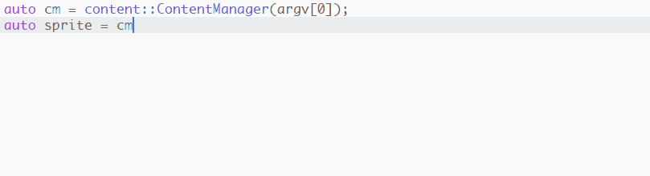

# project-system-clang-complete package

This package provides completions (for [autocomplete-plus](https://atom.io/packages/autocomplete-plus)) by asking clang to provide them.

## Requirements

* [autocomplete-plus](https://atom.io/packages/autocomplete-plus)
* [clang](http://clang.llvm.org/) in your environment path

## Future Notes

More thorough integration will be provided in the future via the project system I have planned.

## .clang_complete

A search for auto-complete-clang.el compatible .clang_complete will be made, if found any arguments found in the file will be added. e.g.

    -IC:\MinGW\lib\gcc\mingw32\4.8.1\include
    -IC:\MinGW\include
    -ID:\dev\gh\cc\src
    -IC:\local\boost-1_56_0_b1

## License

MIT License (see license.md)
